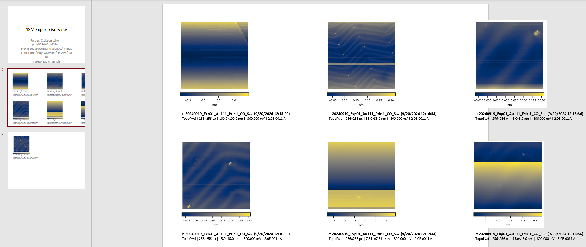
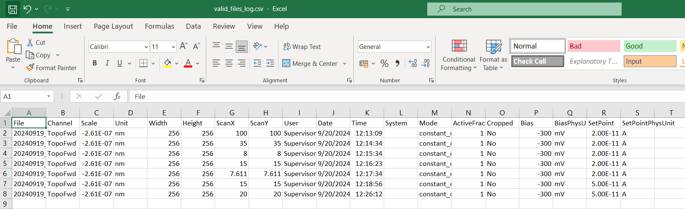
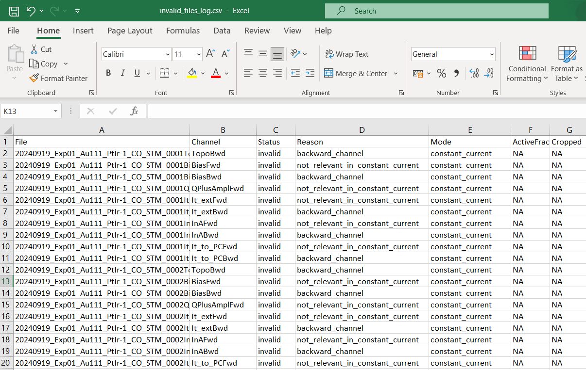

# Anfatec SXM files (.int and .txt)→ XYZ files Python exporter


This project converts Anfatec `.int` + `.txt` acquisition files into WSxM/Gwyddion-compatible ASCII `.xyz` files.  
It also validates which channels are relevant, logs valid/invalid files, and produces a PowerPoint overview of the exported data. This last thing was inspired by the project SpmImageTycoon of Alex Riss (https://github.com/alexriss/SpmImageTycoon.jl) written in Julia and that is excellent for Nanonis files. 

---

## Features

- Parse Anfatec `.txt` + `.int` metadata and raw data.  
- Export valid data channels into `.xyz` (compatible with WSxM, Gwyddion, etc.).  
- Channel validation rules:
  - Only forward scans are kept.
  - Only relevant channels per mode (STM constant-current vs constant-height).
  - Files with flat or invalid data are excluded.
  - Cropped scans are automatically trimmed to remove constant rows/columns.
- Generate logs:
  - `valid_files_log.csv` → list of good exports with full metadata.
  - `invalid_files_log.csv` → rejected channels with reasons for exclusion.
- Build a PowerPoint overview:
  - Plane-corrected previews of exported `.xyz`.
  - Two rows × three columns layout with colorbars.
  - Captions include filename, date/time, pixel size, scan size, bias, and setpoint.
  - Checkboxes next to each image for quick review.

---

## Example Outputs


### PowerPoint Overview
Quick visual summary of all valid channels (plane corrected):



---
### Valid Export Log
Each row corresponds to a valid exported channel with metadata:



---

### Invalid Export Log
Rejected files with reasons for exclusion (backward channel, irrelevant channel, flat data, etc.):



---


## Usage

### 1. Convert SXM to XYZ
Place your `.txt` and `.int` files inside the `data/` folder, then run:

```bash
python convert_sxm__to_xyz.py
```

This will:
- Parse `.txt` metadata and `.int` data.
- Export valid `.xyz` files into the `data/` folder.
- Write `valid_files_log.csv` and `invalid_files_log.csv`.

---

### 2. Build PowerPoint Overview
Once `.xyz` files exist, run:

```bash
python export_to_ppt.py
```

This will:
- Read `valid_files_log.csv`.
- Generate an `overview.od` file with all valid channels (2×3 grid per slide).
- Apply quick plane correction for visualization.

---

## Requirements

- Python 3.9+  
- Dependencies:
  - `numpy`
  - `matplotlib`
  - `pillow`
  - `python-pptx`
  - `tqdm`

Install with:

```bash
pip install -r requirements.txt
```

---

## Notes

- The overview applies plane correction only for quick inspection.  
  For analysis, always use the raw `.xyz` data.  
- The cropping logic ensures that half-finished scans or constant strips are trimmed automatically.  
- Use the logs (`valid_files_log.csv`, `invalid_files_log.csv`) to track decisions and filtering.
